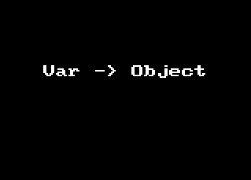

# The Magic of Multiple Cursors


<sub>Image from: https://www.imdb.com/title/tt4154756/mediaviewer/rm3030477312</sub>

The image above shows _many instances_ of Dr. Strange just before he uses these clones to restrain Thanos. Imagine instead that it's him with a bunch of extra arms. How awesome would that be? Think of the surgeries he could perform with all those!

                DR. STRANGE
        Scalpel!

                ASSISTANT
        Um... you're holding it.

                DR. STRANGE
        What?! Oh yes, arm number 6!

How cool would it be to have a few extra arms to get more work done? While we won't be getting multiple arms anytime soon, sometimes I feel like I already have them when using **multiple cursors**.

## Multiple cursors, huh?

Multiple cursors is a text editor feature pioneered by Sublime Text. These days it's been adopted by most modern code editors. Of course the _cursor_ is where the things you type appear, so imagine if you had 2 or 3 _or 100_ of those cursors on screen! Whatever you typed would happen **simultaneously at _every_ cursor location**. You type a word, and that word is inserted at each of those cursors. Sounds like magic. But what good is it?

In this post I'll show you how to use multiple cursors with demos of how I use them most often.

## How do you add/remove cursors?

Before showing the common uses, you need to understand the basics of how to add and remove cursors. This is different for every editor/OS combination. I'm using [Visual Studio Code](https://code.visualstudio.com/) on a Mac. If you're not, do some research to learn the commands for your platform.

### In VS Code on macOS

-   OPT+CLICK: adds a cursor where you clicked
-   CMD+D: adds a cursor at the current selection's next match
-   CMD+SHIFT+L: adds cursors at all matches for the current selection
-   CMD+U: Remove most recently added cursor(s). Really this undoes the last cursor operation and is like CMD+Z but for your cursor operations. Very powerful. I don't know of any way to _redo_ the last undone cursor operation. Do you? Please fill me in!
-   ESC or CLICK: Remove all added cursors
-   Add another cursor on the line below this one
-   Add another cursor on the line above this one.

You may want to try these in your own editor to get a feel for them before continuing.

## BUT... why not just use find/replace?


<sub>Image from: https://cnet1.cbsistatic.com/img/ab9ZqBn8bHqACaSY0PiENzVz6EU=/980x551/2016/10/24/a8d0765a-c5cd-4a54-adbe-4ca99418e6c5/strange5.jpg</sub>

    You're looking at the world through a keyhole.
    You've spent your whole life trying to widen that keyhole...
    And now on hearing that it can be widened,
      in ways you can't imagine,
      you reject the possibility!

    - The Ancient One

When first learning about multiple cursors some years ago I wondered why we needed a replacement for find/replace. Now I realize multiple cursors can do so much more. They can do things not possible with find/replace. Think about it. With typical find/replace, you can only replace what you found. With multiple cursors, you can move beyond what you've found into uncharted territory. That's where things get interesting.

One thing multiple cursors can _not_ do is operate on multiple files at the same time. This is where you need find/replace.

## Basic level

I'll share my most common use cases. Let me know if I'm missing one of yours. Once you start using them, you find lots of excuses to use them more.

### Find/Replace (in a single file)

If you need to rename a variable in a single file, multiple cursors are a good choice. Since this is exactly the realm of find/replace, lets compare the approaches in detail.

With find/replace I would:

1. highlight the word (hopefully by double-clicking it)
1. hit CMD+F to start a search in the file
1. **move my mouse to the search box** (or SHIFT-TAB to focus on the twistie)
1. click the twistie to open the replace box (or ENTER)
1. click in the replace box (or TAB TAB)
1. type the new name in the replace box
1. click the "replace all" icon

With multiple cursors I can just:

1. highlight the word (either by double-clicking it or if the cursor is on it, just CMD+D)
1. hit CMD+D a bunch of times (1 for each occurance to replace ... it's nice to see them all ... or if you're confident, CMD+SHIFT+L to select all matches)
1. type the new name
1. hit ESC to exit multicursor mode

As you can see, going the multiple cursor route saves steps. And most importantly it completely avoids moving the mouse out of the editing area. Mouse moves are productivity killers.

## Building blocks to level up

Find/replace is the simplest use case for multiple cursors. To move beyond this you need to pair multiple cursors with other techniques I consider building blocks. These are platform-specific keyboard combinations to move the cursor and select/unselect. Learn how to do them on your platform. (These will also really help you in word processing outside your code editor)

### Move the cursor one character/line (start with the obvious)

-   LEFT-ARROW: moves LEFT a character
-   RIGHT-ARROW: moves RIGHT a character
-   UP-ARROW: moves UP a line
-   DOWN-ARROW: moves DOWN a line

### Move the cursor one word

-   OPT+LEFT-ARROW: moves LEFT one word.
-   OPT+RIGHT-ARROW: moves RIGHT one word.

### Move the cursor to the beginning/end of the line

-   CMD+LEFT-ARROW: moves the cursor to the beginning of the line.
-   CMD+RIGHT-ARROW: moves the cursor to the end of the line.

### Move the cursor to the beginning/end of the file

I don't think I've ever used these in combination with multiple cursors, but I'll list them to be complete.

-   CMD+UP-ARROW: moves the cursor to the beginning of the file.
-   CMD+DOWN-ARROW: moves the cursor to the end of the file.

### Select/deselect while moving the cursor

Any time you hold SHIFT while moving the cursor, it will add/remove from the current selection. Whether it adds or removes is determined by whether the area you move past is already selected. So you can think of this as _toggling_ the selection state of the areas you move past.

There are many many combinations of using SHIFT with cursor moves so I'll just highlight a few:

-   CMD+SHIFT+RIGHT-ARROW: toggle the selection state of text to the **end** of the line
-   CMD+SHIFT+LEFT-ARROW: toggle the selection state of text to the **beginning** of the line
-   OPT+SHIFT+RIGHT-ARROW: toggle the selection state of the word to the right

### Selecting a column of text

Typically when you select text and move the cursor up or down a line, it selects the entire line. But it is possible to just select a column, or "rectangle", of text instead. And when you do this, you get a cursor on each line. To do it, start by placing the cursor at the top-left of the column you want to select. Then hold SHIFT+OPT and click and drag with the mouse down and to the right. Let go when you have to column you want selected. You'll see a cursor at each line.

## Sorcerer Level

### One-line to multiple (or vice versa)

My positive feelings for [Prettier](https://prettier.io/) are not shared by everyone at work. Sometimes I need to change something Prettier inlined back to multi-line. Multiple cursors make this really easy.

-   highlight the first space
-   press CMD+D a bunch of times (remember if you do it too much, hit CMD+U to undo)
-   press ENTER
-   press ESC or click anywhere to get rid of all the extra cursors

Voila!


Going back the other way? No problem:

-   click in the upper left
-   press and hold SHIFT+OPT then click and drag down to select a column
-   press DELETE twice
-   get out of multi-cursor mode and clean it up


### Add vertical alignment

My rule is to never ever (in 1000 years) add vertical alignment to code. But you may be of a different persuasion. I don't want to hold you back. But there are probably better extensions to handle this if you want to make it a regular part of your dev. (I don't)

-   select the character you want vertically aligned
-   press CMD+D a bunch of times
-   press LEFT-ARROW to get in front of the character
-   press tab until everything you want on the right is outside the column of things you want on the left
-   press and hold SHIFT+OPT then click and drag down to select a column of everything you want on the left
-   press CMD+X to cut that out
-   press SHIFT+TAB a few times to un-indent everything
-   press CMD+V to paste back in the stuff on the left
-   press SPACE to make it perfect


### Maintain vertical alignment

If you must maintain vertical alignment multiple cursors make it mostly painless.

-   add (or remove) something that requires changing the vertical alignment
-   sigh and psych yourself up
-   select the vertically aligned character (or use the column select trick mentioned previously)
-   press CMD+D a bunch of times
-   press LEFT-ARROW to get in front of the vertically aligned character
-   press SPACE or TAB to your hearts content


### Change Variables to Object Fields

Sometime you have some things you assigned to variables but you want them to be in an object. You could do it with a few finds/replaces but it's just easier with multiple cursors.

-   select all the first `const`
-   press CMD+D a bunch of times
-   press SHIFT+RIGHT-ARROW once
-   press DElETE
-   press OPT+RIGHT-ARROW to move past the color name
-   press `:` to add it
-   press fn+DELETE to delete the `=` and extra spaces
-   press CMD+RIGHT-ARROW to move to the end of the line
-   prres DELETE to remove the `;`
-   press `,` and clean it up



The reverse of this can be done using the same same principles. I'll leave it as an exercise.

## Sorcerer Supreme Level

### Repetitive structure editing (e.g. JS objects -> React)

There are times when I have a bunch of objects or data in a certain format and I need to chanage it into some other format. If I have 10 or more JS objects that I need to edit in a similar way, multiple cursors are a must. The best recent example I have is converting JS objects to React components.

How did I do it?

#### Before

```JavaScript
let people = [
    {
        firstName: 'Bob',
        lastName: 'Jones',
        title: 'Manager',
        address: {
            line1: '475 1st St. South',
            line2: 'Fakeland, MM 55555',
        },
        phone: '555-789-3948',
        email: 'bobby@gmail.com',
    },
    {
        firstName: 'Jessica',
        lastName: 'Smith',
        title: 'Director of Everything',
        address: {
            line1: '5 Blue Rd.',
            line2: 'Awesome Place, MM 55555',
        },
        phone: '+1 555-032-3333',
        email: 'jill@gmail.com',
    },
];
```

#### After

```
let people = (
    <People>
        <Person
            firstName="Bob"
            lastName="Jones"
            title="Manager"
            phone="555-789-3948"
            email="bob@gmail.com"
        >
            <Address line1="475 1st St. South" line2="Fakeland, MM 55555" />
        </Person>
        <Person
            firstName="Jill"
            lastName="Smith"
            title="Director"
            phone="+1 555-032-3333"
            email="jill@gmail.com"
        >
            <Address line1="892 101st St. North" line2="Fakeland, MM 55555" />
        </Person>
    </People>
);

```

#### Set up your cursors

The first thing to do is plan where you want cursors. In this case I'd want them at the beginning of each `Person` object which starts with the open curly brace. If you look you'll immediately see a problem. How can I select just those when there are other open curlys?

##### Use whitespace for matching

If I select from the beginning of the line to the open curly, then only the right ones match.

### Get a cursor on _every_ line

-   CMD+A
-   SHIFT+OPT+I

## Takeaways

Now you know what you can do with multiple cursors

## Comments?

How do you use multiple cursors? Give me your tips so I can level-up. Thanks!
