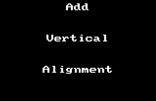
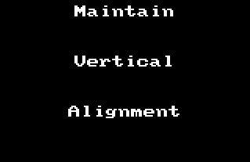

# The Magic of Multiple Cursors


<sub>Image from: https://www.imdb.com/title/tt4154756/mediaviewer/rm3030477312</sub>

The image above shows _many instances_ of Dr. Strange, but just for a second, let's imagine it's him with a bunch of extra arms. How awesome would that be? Think of the surgeries he could perform with all those!


                DR. STRANGE
        Scalpel!

                ASSISTANT
        Um... you're holding it.

                DR. STRANGE
        What?! Oh yeah, arm number 6. Sorry!

But seriously, how cool would it be to have a few extra arms/hands to get more work done? It's just fantasy, but the reality is, sometimes I feel like this when I'm editing code using **multiple cursors**.

## What are multiple cursors?
Multiple cursors (closely related to multiple selection) is a text editor feature pioneered by Sublime Text. These days it's been adopted by most modern code editors. Obviously, the cursor is where the things you type appear, so imagine if you had 2 or 3 _or 100_ of those cursors on screen! Whatever you typed would happen **simultaneously at _every_ cursor location**. You type a word, and that word is inserted at each of those cursors. Sounds like magic.

In this post I'll show you how to use multiple cursors with demos of how I use them most often.

## How do you add/remove cursors?
Before showing the common use cases, we need to understand the basics of how to add and remove cursors. This is different for every editor/OS combination. I'm using [Visual Studio Code](https://code.visualstudio.com/) on a Mac. If you're not, do some research to learn the commands for your platform.

### In VS Code on macOS
- Add a cursor
    - press and hold OPT then click somewhere
- Add a cursor at the current selection's next match<sup>*</sup>
    - CMD+D
- Add cursors at all matches for the current selection
    - CMD+SHIFT+L
- Remove most recently added cursor(s)
    - CMD+U
- Remove all added cursors
    - press ESC or click anywhere in the app running the editor

<sub>\* Note: in VS Code, whether the next match is case-sensitive or restricted to whole-word matches is governed by a small popup that appears in the upper right.</sub>

You may want to try these in your own editor to get a feel for them before continuing.

## Why not just use find/replace?
When first learning about multiple cursors some years ago I wondered why we needed a replacement for find/replace. Now I realize multiple cursors can do so much more. They can do things not possible with find/replace. Think about it. With typical find/replace, you can only replace what you found. With multiple cursors, you can move beyond what you've found into uncharted territory. That's where things get interesting.

One thing multiple cursors can _not_ do is operate on multiple files at the same time. This is where you need find/replace.

## When should I use multiple cursors?
I'll share my most common use cases. Please comment if I'm missing one that you like.

### Find/Replace (in a single file)
If you need to rename a variable in a single file, multiple cursors are a good choice. Since this is exactly the realm of find/replace, lets compare the approaches in detail.

With find/replace I would:
1. highlight the word (hopefully by double-clicking it)
1. hit CMD+F to start a search in the file
1. **move my mouse to the search box** (or SHIFT-TAB to focus on the twistie)
1. click the twistie to open the replace box (or ENTER)
1. click in the replace box (or TAB TAB)
1. type the new name in the replace box
1. click the "replace all" icon

With multiple cursors I can just:
1. highlight the word (either by double-clicking it or if the cursor is on it, just CMD+D)
1. hit CMD+D a bunch of times (1 for each occurance to replace ... it's nice to see them all ... or if you're confident, CMD+SHIFT+L to select all matches)
1. type the new name
1. hit ESC to exit multicursor mode

As you can see, going the multiple cursor route saves steps. And most importantly it completely avoids moving the mouse out of the editing area. Mouse moves are productivity killers.

### One-line to multiple (or vice versa)
My positive feelings for [Prettier](https://prettier.io/) are not shared by everyone at work. Sometimes I need to change something Prettier inlined back to multi-line. Multiple cursors make this really easy.

- highlight the first space
- press CMD+D a bunch of times (remember if you do it too much, hit CMD+U to undo)
- press ENTER
- press ESC or click anywhere to get rid of all the extra cursors

Voila!


Going back the other way? No problem:

- click in the upper left
- press and hold SHIFT+OPT then click and drag down to select a column
- press DELETE twice
- get out of multi-cursor mode and clean it up


### Add vertical alignment
My rule is to never ever (in 1000 years) add vertical alignment to code. But you may be of a different persuasion. I don't want to hold you back. But there are probably better extensions to handle this if you want to make it a regular part of your dev. (I don't)

- select the character you want vertically aligned
- press CMD+D a bunch of times
- press LEFT-ARROW to get in front of the character
- press tab until everything you want on the right is outside the column of things you want on the left
- press and hold SHIFT+OPT then click and drag down to select a column of everything you want on the left
- press CMD+X to cut that out
- press SHIFT+TAB a few times to un-indent everything
- press CMD+V to paste back in the stuff on the left
- press SPACE to make it perfect



### Maintain vertical alignment
If you must maintain vertical alignment multiple cursors make it mostly painless.

- add (or remove) something that requires changing the vertical alignment
- sigh and psych yourself up
- select the vertically aligned character (or use the column select trick mentioned previously)
- press CMD+D a bunch of times
- press LEFT-ARROW to get in front of the vertically aligned character
- press SPACE or TAB to your hearts content



### Repetetive structure editing
This is where I feel I get the biggest bang for the buck with multiple cursors. If I have 10 or more JS objects that I need to edit in a similar way, multiple cursors are a must. The best recent example I have is converting JavaScript objects to React components. I had an array of a bunch of objects and needed to turn them into components for some static content we were displaying.

How did I do it?

#### Before
```JavaScript
let people = [
    {
        firstName: 'Bob',
        lastName: 'Jones',
        title: 'Manager',
        address: {
            line1: '475 1st St. South',
            line2: 'Fakeland, MM 55555',
        },
        phone: '555-789-3948',
        email: 'bobby@gmail.com',
    },
    {
        firstName: 'Jessica',
        lastName: 'Smith',
        title: 'Director of Everything',
        address: {
            line1: '5 Blue Rd.',
            line2: 'Awesome Place, MM 55555',
        },
        phone: '+1 555-032-3333',
        email: 'jill@gmail.com',
    },
];
```
#### After
```
let people = (
    <People>
        <Person
            firstName="Bob"
            lastName="Jones"
            title="Manager"
            phone="555-789-3948"
            email="bob@gmail.com"
        >
            <Address line1="475 1st St. South" line2="Fakeland, MM 55555" />
        </Person>
        <Person
            firstName="Jill"
            lastName="Smith"
            title="Director"
            phone="+1 555-032-3333"
            email="jill@gmail.com"
        >
            <Address line1="892 101st St. North" line2="Fakeland, MM 55555" />
        </Person>
    </People>
);

```
#### Set up your cursors
The first thing to do is plan where you want cursors. In this case I'd want them at the beginning of each `Person` object which starts with the open curly brace. If you look you'll immediately see a problem. How can I select just those when there are other open curlys?

##### Use whitespace for matching
If I select from the beginning of the line to the open curly, then only the right ones match.


## Handy Tips/Tricks
### Keyboard shortcuts that really help

- move to beginning/end of line (CMD+LEFT-ARROW or RIGHT-ARROW)
- move to beginning/end of word (OPT+LEFT-ARROW or RIGHT-ARROW)
-


### Get a cursor on _every_ line
- CMD+A
- SHIFT+OPT+I

## Takeaways
Now you know what you can do with multiple cursors

## Comments?
How do you use multiple cursors? Give me your tips so I can level-up. Thanks!
